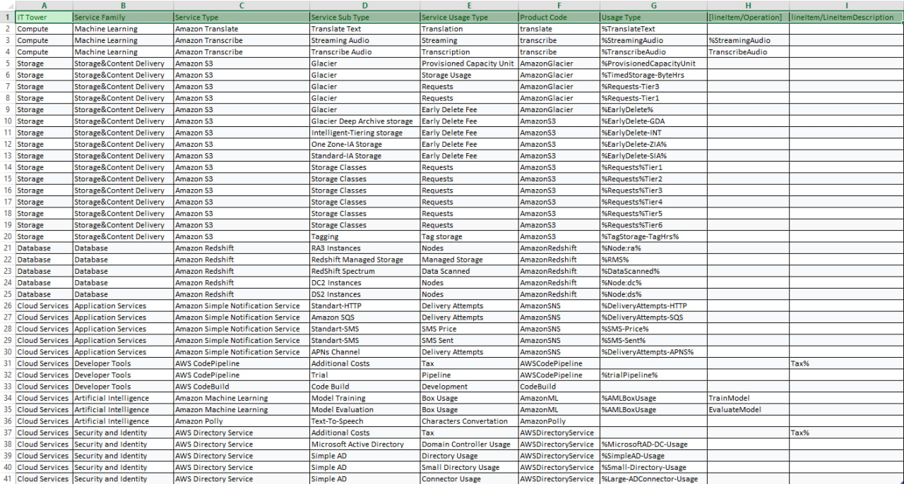

# Лабораторная работа №1. Знакомство с IaaS, PaaS, SaaS сервисами в облаке на примере Amazon Web Services (AWS). Создание сервисной модели.
# Вариант 1
# Цель работы
  Знакомство с облачными сервисами. Понимание уровней абстракции над инфраструктурой в облаке. Формирование понимания типов потребления сервисов в сервисной-модели.
# Дано
1. Слепок данных биллинга от провайдера после небольшой обработки в виде SQL-параметров. Символ % в начале/конце означает, что перед/после него может стоять любой набор символов.
2. Образец итогового соответствия, что желательно получить в конце. В этом же документе
# Необходимо
1. Импортировать файл .csv в Excel или любую другую программу работы с таблицами. Для Excel делается на вкладке Данные – Из текстового / csv файла – выбрать файл, разделитель – точка с запятой.
2. Распределить потребление сервисов по иерархии, чтобы можно было провести анализ от большего к меньшему (напр. От всех вычислительных ресурсов Compute дойти до конкретного типа использования - Выделенной стойка в датацентре Dedicated host usage).
3. Сохранить файл и залить в соответствующую папку на Google Drive.
# Алгоритм работы
Сопоставить входящие данные от провайдера с его же документацией. Написать в соответствие колонкам справа значения 5 колонок слева, которые бы однозначно классифицировали тип сервиса. Для столбцов IT Tower и Service Family значения можно выбрать из образца.
# Данные
У нас есть слепок данных биллинга

# Описание сервисов

1. Amazon Redshift — это облачный сервис хранилища данных от AWS, который позволяет хранить и анализировать большие объёмы информации с помощью SQL-запросов. Он оптимизирован для быстрой аналитики и интегрируется с другими сервисами AWS.
2. AWS Directory Service — это облачный сервис AWS, который позволяет развернуть и использовать Active Directory или подключиться к уже существующему AD. Он упрощает управление пользователями, группами и доступом к ресурсам в AWS и интеграцию с корпоративными системами.
3. Amazon Glacier — это облачный сервис от AWS для долгосрочного и дешёвого хранения архивных данных. Он подходит для информации, к которой обращаются редко, и предусматривает разные режимы восстановления — от нескольких минут до часов.
4. Amazon S3 — это облачный сервис хранения объектов от AWS. В нём можно хранить любые файлы (документы, изображения, бэкапы, логи и т. д.), масштабировать объём без ограничений и получать доступ к данным через интернет.
5. Amazon SNS (Simple Notification Service) — это облачный сервис рассылки уведомлений от AWS. Он позволяет отправлять сообщения в разные каналы (email, SMS, push-уведомления, очереди SQS, Lambda) и использовать модель pub/sub для доставки информации подписчикам.
6. Amazon Translate — это облачный сервис AWS для автоматического перевода текста на разные языки. Он использует машинное обучение (нейросети) и позволяет в реальном времени переводить приложения, сайты или большие массивы текстов.
7. Amazon Transcribe — это сервис AWS для автоматического распознавания речи. Он преобразует аудио- и видео-записи в текст, поддерживает несколько языков, умеет выделять говорящих и добавлять временные метки.
8. AWS CodePipeline — это сервис AWS для автоматизации процессов CI/CD. Он помогает настраивать конвейеры, которые автоматически строят, тестируют и развёртывают приложения при изменении кода.
9. AWS CodeBuild — это управляемый сервис AWS для автоматической сборки кода. Он компилирует исходники, запускает тесты и формирует готовые артефакты для дальнейшего развёртывания.
10. Amazon ML — это сервис AWS для создания, обучения и развёртывания моделей машинного обучения. Он позволяет анализировать данные и делать прогнозы без глубоких знаний в ML.
11. Amazon Polly — это сервис AWS для преобразования текста в реалистичную речь. Он поддерживает множество языков и голосов, позволяя создавать аудиоконтент и голосовые интерфейсы.
# Выполненная работа

Таблицу можно посмотреть [тут](https://docs.google.com/spreadsheets/d/1oSuVwSiUF1MVgYSBK1a0S8NEJ9pEByzZ/edit?usp=sharing&ouid=109182249355339306429&rtpof=true&sd=true)

# Вывод

В ходе выполнения лабораторной работы я познакомился с основными облачными сервисами, изучим уровни абстракции, применяемые в облачной инфраструктуре. Пришло понимание различных моделей потребления сервисов, начал лучше ориентироваться в сервисной модели облака.   

 

