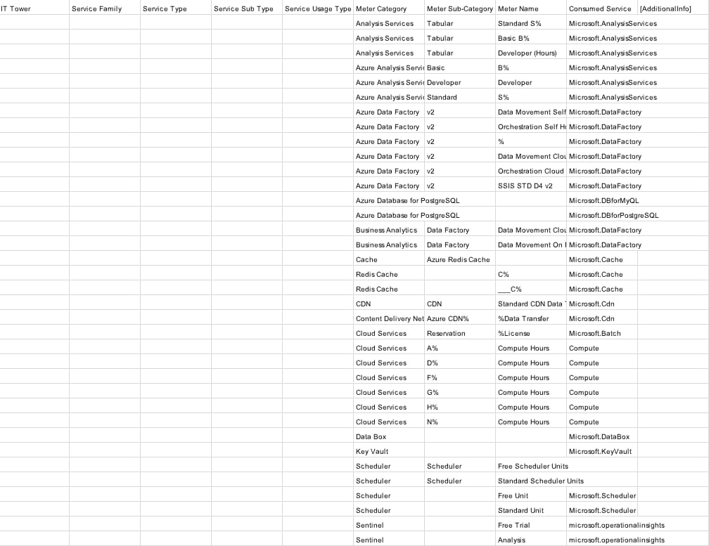

# Лабораторная работа 2. Сравнение сервисов Amazon Web Services и Microsoft Azure. Создание единой кросс-провайдерной сервисной модели.

## Вариант 1

## Цель работы:

Получение навыков аналитики и понимания спектра публичных облачных сервисов без привязки к вендору. Формирование у студентов комплексного видения Облака.

## Дано:

1. Данные лабораторной работы 1.
2. Слепок данных биллинга от провайдера после небольшой обработки в виде SQL-параметров. Символ % в начале/конце означает, что перед/после него может стоять любой набор символов.
3. Образец итогового соответствия, что желательно получить в конце. В этом же документе

## Необходимо:

1. Импортировать файл .csv в Excel или любую другую программу работы с таблицами. Для Excel делается на вкладке Данные – Из текстового / csv файла – выбрать файл, разделитель – точка с запятой.
2. Распределить потребление сервисов по иерархии, чтобы можно было провести анализ от большего к меньшему (напр. От всех вычислительных ресурсов Compute дойти до конкретного типа использования - Выделенной стойка в датацентре Dedicated host usage). При этом сохранять логическую концепцию, выработанную в Лабораторной работе 1.
3. Сохранить файл и залить в соответствующую папку на Google Drive.

## Алгоритм работы:

Сопоставить входящие данные от провайдера с его же документацией. Написать в соответствие колонкам справа значения 5 колонок слева, которые бы однозначно классифицировали тип сервиса. Для столбцов IT Tower и Service Family значения можно выбрать из образца. В ходе выполнения работы не отходить от принципов классификации, выбранных в Лабораторной работе 1. Например, если сервис Машинного обучения был разбит на Вычислительные мощности и Облачные сервисы, то продолжать его разбивать и в новых данных.

## Данные:

У нас есть слепок данных биллинга

## Описание сервисов:

1. Azure Analysis Services — это облачный сервис для создания и управления семантическими моделями данных с использованием языка DAX, позволяющий объединять данные из разных источников, выполнять сложный аналитический расчёт, обеспечивать безопасность на уровне модели.
2. Azure Data Factory — это облачный сервис, который позволяет создавать конвейеры интеграции данных, перемещать и преобразовывать данные из различных источников.
3. Azure Database for PostgreSQL / MySQL — это полностью управляемые облачные СУБД, обеспечивающие автоматическое резервное копирование, масштабирование, обновления и высокую доступность, позволяющие разворачивать приложения на базе PostgreSQL или MySQL.
4. Azure Redis Cache — это управляемый облачный сервис кэширования, который обеспечивает высокопроизводительный доступ к данным в памяти для ускорения работы приложений, снижения нагрузки на базы данных.
5. Azure CDN — это глобальная сеть доставки контента, которая кэширует статические файлы в распределённых дата-центрах и обеспечивает быструю и надёжную доставку веб-контента пользователям по всему миру.
6. Azure Batch — это облачный сервис для массовых параллельных вычислений, который автоматически распределяет задачи по пулу виртуальных машин, позволяя запускать крупные расчёты, рендеринг и обработку больших объёмов данных.
7. Azure Virtual Machines — это облачный сервис IaaS, предоставляющий масштабируемые виртуальные серверы с различными операционными системами, которые можно использовать для хостинга приложений, баз данных, разработки, тестирования и запуска любых вычислительных нагрузок.
8. Azure Data Box — это устройство для безопасного переноса больших объёмов данных между локальной инфраструктурой и облаком Azure.
9. Azure Key Vault — это облачный сервис для безопасного хранения и управления ключами, сертификатами и секретами.
10. Azure Scheduler — это облачный сервис планирования задач, позволяющий автоматически запускать действия по расписанию или по событиям.
11. Azure Sentinel — это облачный сервис, который собирает и анализирует данные безопасности из разных источников, использует встроенный искусственный интеллект для выявления угроз и автоматизирует реагирование на них.

## Выполненная работа:

