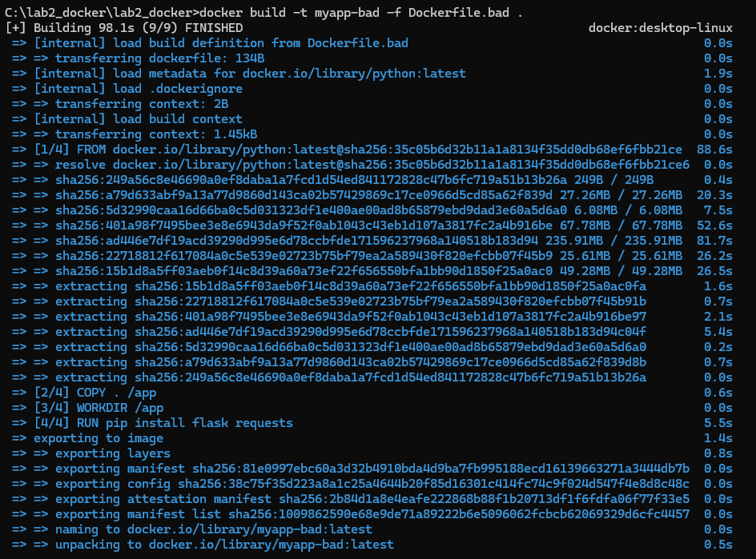

# 2 Лабораторная обычная
## Задание:
1. Написать “плохой” Dockerfile, в котором есть не менее трех “bad practices” по написанию докерфайлов
2. Написать “хороший” Dockerfile, в котором эти плохие практики исправлены
3. В Readme описать каждую из плохих практик в плохом докерфайле, почему она плохая и как в хорошем она была исправлена, как исправление повлияло на результат
4. В Readme описать 2 плохих практики по работе с контейнерами. ! Не по написанию докерфайлов, а о том, как даже используя хороший докерфайл можно накосячить именно в работе с контейнерами.
## Плохой Dockerfile:
```
FROM python:latest
COPY . /app
WORKDIR /app
RUN pip install flask requests
CMD python app.py
```

Собираем образ:



"bad practices" в этом Docerfile:
1. Использовать latest оч опасно, образ может обновиться/измениться, что вызовет проблемы в работе с контейнером.
2. Copy . /app - копировать всё тоже нехорошо, попадут ненужные файлы, увеличит размер образа.
3. Установка зависимостей без версий - при каждой установке пакеты могут обновляться и ломать код.

## Хороший Dockerfile:
```
FROM python:3.11-slim
WORKDIR /app
COPY requirements.txt .
RUN pip install --no-cache-dir -r requirements.txt
COPY app.py .
CMD ["python", "app.py"]
```

Собираем образ:

![](media/
